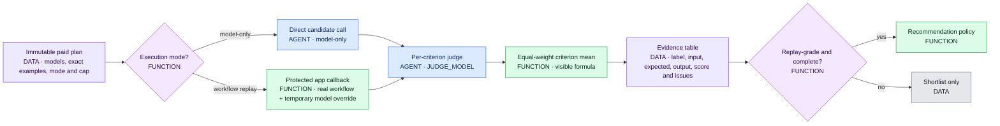

# Blindspot — Architecture Flow

> **Status: hosted invite-only beta verified through the truthful-evidence UX correction on 2026-07-21.**
> The SDK discovers real workflows, the dashboard separates every workflow node from model-only
> Routes, golden sets are versioned and consent-aware, budgeted evals persist per-example evidence,
> and production model recommendations require real workflow replay. Each beta company receives an
> isolated project/key, a versioned TypeScript connector, a live connection check and a structured
> feedback path. Open signup/billing, npm publication, Redis/worker durability,
> scheduled live semantic judging, the suggested-additions queue, OTel/Sentry and load hardening
> remain Phase 8 work.
>
> The canonical diagrams are `docs/mermaid/*.mmd`; the standalone all-diagram viewer is
> `docs/architecture-flow.html`.

## What each object means

| Object | Runtime truth |
|---|---|
| Workflow | The whole application flow: agent, generation, retrieval, tool and deterministic function nodes. |
| Route | One **generation node** where a model is used and can be compared or managed. Deterministic code is never mislabeled as a model route. |
| Observe-only | Blindspot records the model the app actually used. Approval means “awaiting app rollout”; Blindspot does not claim it switched the app. |
| Managed | The app asks Blindspot to resolve a node model. Only an approved Recommendation can change that route; fallback keeps the app available. |
| Model-only eval | Direct candidate call for a fast shortlist. It does not run retrieval, tools or deterministic gates and cannot justify a production swap. |
| Workflow-replay eval | A protected callback runs the real app with a temporary target-node model override. This is production-grade evidence. |
| Golden set | A versioned, user-owned asset seeded by structured upload or agent generation from consented documents/context/traces, then curated through CRUD and trace promotion. |
| Drift | Live operational telemetry is collected (automatic thresholds remain Phase 8), live semantic judging needs consent/budget, and golden-eval comparison is active. Developer simulations are quarantined. |
| Beta invite | Operator-created isolated project plus shown-once key. The tester mints a separate revocable app key; open signup is deliberately deferred. |

## Master flow

```mermaid
flowchart TD
  A["Existing agent handles a user request<br/>ENTRY · app keeps its prompts, tools and deterministic code"]:::term
  MODE{"Connection mode?<br/>USER · observe-only is default"}:::dec
  OBS["Observe existing calls and all node kinds<br/>FUNCTION · consent-bounded spans<br/>out: workflow map + generation Routes"]:::fn
  MAN["Resolve generation node to approved model<br/>FUNCTION · managed SDK or gateway<br/>out: provider:model"]:::fn
  LIVE["Run the real application workflow<br/>AGENT + FUNCTION nodes<br/>out: answer, spans, usage, errors and latency"]:::agent
  GOLD["Create versioned golden set<br/>USER · upload, documents, explicitly shared context, or consented traces"]:::ask
  EST["Choose compatible models + eval grade; calculate budget<br/>FUNCTION · exact full/sample disclosure · no provider calls"]:::fn
  CONF{"Confirm exact paid plan?<br/>USER"}:::ask
  EVAL["Execute authorized examples and judge visible criteria<br/>AGENT · candidate + JUDGE_MODEL<br/>DATA · per-example evidence + criterion mean"]:::agent
  GRADE{"Workflow replay?<br/>FUNCTION"}:::dec
  SCREEN["Screening shortlist and issues only<br/>DATA · no production Recommendation"]:::term
  POLICY{"Complete comparable evidence; candidate passes bar and proves benefit?<br/>FUNCTION"}:::dec
  REC["Evidence-backed Recommendation<br/>DATA · Approvals inbox · app unchanged"]:::data
  DECIDE{"Approve or reject?<br/>USER"}:::ask
  APPLY{"Managed connection?<br/>FUNCTION"}:::dec
  SWITCH["Apply route model with stale-baseline check<br/>FUNCTION · audited"]:::fn
  WAIT["Approved · awaiting app rollout<br/>DATA · observe-only route unchanged"]:::term

  A --> MODE
  MODE -- "observe-only" --> OBS --> LIVE
  MODE -- "managed" --> MAN --> LIVE
  LIVE --> GOLD --> EST --> CONF
  CONF -- "revise" --> EST
  CONF -- "confirm" --> EVAL --> GRADE
  GRADE -- "no" --> SCREEN
  GRADE -- "yes" --> POLICY
  POLICY -- "yes" --> REC --> DECIDE
  POLICY -- "no" --> SCREEN
  DECIDE -- "reject" --> SCREEN
  DECIDE -- "approve" --> APPLY
  APPLY -- "yes" --> SWITCH
  APPLY -- "no" --> WAIT

  classDef agent fill:#dbeafe,stroke:#2563eb,color:#0b2a5b;
  classDef fn fill:#dcfce7,stroke:#16a34a,color:#052e16;
  classDef dec fill:#f3e8ff,stroke:#9333ea,color:#2a0a4a;
  classDef term fill:#e5e7eb,stroke:#6b7280,color:#111827;
  classDef ask fill:#cffafe,stroke:#0891b2,color:#083344;
  classDef data fill:#ede9fe,stroke:#7c3aed,color:#2a0a4a;
```



## Evals: what is actually scored



## Gates at a glance

| Gate | Enforcer | Rule |
|---|---|---|
| Data retention | USER + FUNCTION | Effective capture is the stricter of project and SDK; metadata is default. Context and live-trace use each need explicit consent. |
| Technical compatibility | FUNCTION | Provider access plus observed modality, tool, schema, streaming, system-message and context requirements. |
| Eval spend | USER + FUNCTION | Immutable estimate → disclosed full/sample cases → explicit confirmation → single-use plan. |
| Score | FUNCTION | Equal-weight mean of visible criteria; legacy judge overall only when no criteria exist. |
| Production recommendation | FUNCTION | Complete same-plan **workflow-replay** evidence for live and candidate; candidate meets bar and proves the policy claim. |
| Approval | USER | No live change before approve. Managed applies; observe-only becomes awaiting rollout. Auto-approve remains per-route opt-in and off by default. |
| Replay network | FUNCTION | HTTPS public destination, no credentials/fragments/redirects, DNS private-range block, 90-second timeout and 2MB response cap. |
| Drift | FUNCTION | Comparable workflow-replay golden eval is active; operational telemetry is collected but automatic thresholds remain Phase 8; live semantic needs content/budget consent. Simulation is excluded from history, evidence and Recommendations. |

## Diagram index

| Stage | Diagram |
|---|---|
| Master | [`00-master-flow.mmd`](./mermaid/00-master-flow.mmd) |
| Approved build decisions | [`01-build-decisions.mmd`](./mermaid/01-build-decisions.mmd) |
| Golden-set lifecycle | [`02-golden-sets.mmd`](./mermaid/02-golden-sets.mmd) |
| Eval + Recommendation | [`03-eval-recommend.mmd`](./mermaid/03-eval-recommend.mmd) |
| Drift lanes | [`04-drift-gate.mmd`](./mermaid/04-drift-gate.mmd) |
| Dashboard + management API | [`05-dashboard-mgmt.mmd`](./mermaid/05-dashboard-mgmt.mmd) |
| Connect + Observe/Managed | [`06-connect-observe.mmd`](./mermaid/06-connect-observe.mmd) |
| Registry + compatibility | [`07-model-registry-compatibility.mmd`](./mermaid/07-model-registry-compatibility.mmd) |
| Budget authorization | [`08-budgeted-eval-authorization.mmd`](./mermaid/08-budgeted-eval-authorization.mmd) |

Regenerate the standalone viewer after diagram changes:

```bash
node /Users/anandpareek/.codex/skills/power-coding/scripts/build-html.mjs docs/mermaid docs/architecture-flow.html
```
