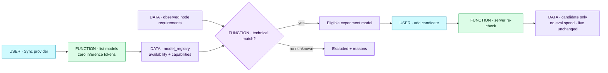

# Blindspot — Architecture Flow

> **Status: Phases 0–7 verified live; Phases 7A–7C built 2026-07-18.** The original
> loop + dashboard run against Groq + Supabase; the SDK/ingestion/workflow path plus the
> account-scoped model registry, node compatibility gate, immutable eval plans, deterministic
> budget sampling and per-example evidence are implemented and await the first gstpilot connection.
> Pending: Phase 7D (continuous loop) and Phase 8 (queue scale, crash recovery, observability,
> rate limits). These diagrams describe the *real* runtime; update the `.mmd` in the same
> session as any structural change — the git diff of the `.mmd` IS the change highlight.
> Regenerate the standalone viewer with:
> `node /Users/anandpareek/.codex/skills/power-coding/scripts/build-html.mjs docs/mermaid docs/architecture-flow.html`
>
> **Diagrams:** `00` master loop · `01` build decisions · `02` golden sets · `03` eval→recommend ·
> `04` drift→gate · `05` dashboard + management API · `06` Connect + Observe ·
> `07` Model Registry + Compatibility · **`08` Budgeted Eval Authorization**.

## Legend
| Label | Meaning |
|---|---|
| **AGENT · model** | an LLM makes the decision/generation (model named) |
| **FUNCTION** | deterministic code, no model |
| **LIBRARY · name** | an external library does the heavy lifting |
| **DATA · store** | a table/store being read or written |
| **USER** | a decision only the human can make (approve/reject) |

## Gates at a glance
| Gate | Enforcer | Threshold / rule |
|---|---|---|
| Policy (recommend) | FUNCTION | cheapest candidate with judge score **≥ 0.85** (per route) |
| Drift detection | FUNCTION | new score **below** route band (old − margin) → drift event |
| Approval | USER | no `live_model` change without approve — unless route `auto_approve` = ON |
| Auto-approve (opt-in) | FUNCTION | within quality band **AND** cost decreases (default OFF) |
| CI Gate | FUNCTION | legacy paid endpoint is closed; plan-aware queued CI gate returns in Phase 8 |
| Content retention | USER + FUNCTION | effective mode is the stricter of SDK and project (`metadata` default) |
| Workflow selection | USER | discovery is observe-only until `workflows.selected = true` |
| Provider availability | FUNCTION | read-only account catalog sync; no inference/token spend |
| Technical compatibility | FUNCTION | key/access plus modality, tool, schema, streaming, system and context requirements |
| Eval spend | USER + FUNCTION | immutable estimate → exact disclosed sample → explicit confirmation → single-use plan; legacy paid paths return 409 |

## Master flow — Observe → Eval → Recommend → Approve → Route → Gate

```mermaid
flowchart TD
  A["User agent call<br/>ENTRY · base_url points to gateway, model = route:name"]:::term
  B["Resolve route to approved live_model<br/>FUNCTION<br/>in: route:name · out: concrete model_ref"]:::fn
  C{"Route exists?<br/>FUNCTION"}:::dec
  D["Auto-create route with default policy<br/>FUNCTION · out: routes row"]:::fn
  E["Decrypt user provider key<br/>FUNCTION · AES-256-GCM<br/>in: provider_keys.encrypted_key · out: in-memory key"]:::fn
  F["Live LLM call through user key<br/>LIBRARY · Vercel AI SDK adapter<br/>in: prompt + model_ref · out: completion"]:::data
  G["Write trace<br/>DATA · traces · cost, latency, output"]:::data
  EST["Calculate full cost and deterministic sample<br/>FUNCTION · no provider calls<br/>DATA · eval_plans status = draft"]:::fn
  CONF{"User confirms disclosed cap and exact cases?<br/>USER"}:::ask
  H["Lock single-use plan and run inline locally<br/>FUNCTION · Phase 8 queues the same authorization"]:::data
  I["Judge scores golden set<br/>AGENT · JUDGE_MODEL<br/>in: outputs vs golden_examples · out: per-criterion scores"]:::agent
  J["Aggregate avg_score, cost, latency<br/>FUNCTION · writes DATA · eval_runs"]:::fn
  K{"Drift? new score below route band<br/>FUNCTION · new below old minus margin"}:::dec
  L{"Policy: cheaper candidate at or above bar?<br/>FUNCTION · cheapest with score at or above 0.85"}:::dec
  M["Create Recommendation with evidence<br/>FUNCTION · per-criterion scores, cost and latency delta, 3 side-by-side samples<br/>DATA · recommendations status = pending"]:::fn
  N["Approvals inbox<br/>DATA · recommendations"]:::data
  O{"User decision<br/>USER · approve or reject"}:::ask
  P["Apply: update routes.live_model<br/>FUNCTION · drift auto-revert ONLY if route.auto_approve"]:::fn
  Q["Store rejection reason, tunes future recs<br/>FUNCTION · DATA · recommendations status = rejected"]:::fn
  R["CI Gate paid endpoint<br/>FUNCTION · closed with 409 until Phase 8 consumes an approved plan"]:::term

  A --> B --> C
  C -- "no" --> D --> E
  C -- "yes" --> E
  E --> F --> G
  F --> EST --> CONF
  CONF -- "confirm" --> H --> I --> J
  CONF -- "change budget/models" --> EST
  J --> K
  J --> L
  K -- "yes, quality dropped" --> M
  L -- "yes, cheaper passes" --> M
  M --> N --> O
  O -- "approve" --> P
  O -- "reject" --> Q
  R -.-> L

  classDef agent fill:#dbeafe,stroke:#2563eb,color:#0b2a5b;
  classDef fn fill:#dcfce7,stroke:#16a34a,color:#052e16;
  classDef dec fill:#f3e8ff,stroke:#9333ea,color:#2a0a4a;
  classDef term fill:#e5e7eb,stroke:#6b7280,color:#111827;
  classDef ask fill:#cffafe,stroke:#0891b2,color:#083344;
  classDef data fill:#ede9fe,stroke:#7c3aed,color:#2a0a4a;
```

## Connect + Observe — discover first, optimize only after selection

```mermaid
flowchart TD
  APP["Existing agent model call<br/>FUNCTION<br/>in: application request · out: model result"]:::term
  SDK["Blindspot SDK wrapper<br/>FUNCTION · project-key/capture envs, 900 KB cap, bounded one retry<br/>terminal status emitted at the real request boundary<br/>in: node, model, usage, optional content · out: queued span or metadata fallback"]:::fn
  CAP{"Effective capture mode<br/>FUNCTION · stricter of SDK and project<br/>metadata, inputs, or full"}:::dec
  API["POST /v1/ingest/spans<br/>FUNCTION · auth, 1 MB cap, Zod batch max 100<br/>in: spans + bs_live key · out: accepted ids"]:::fn
  REDACT["Credential-field redaction<br/>FUNCTION<br/>in: permitted payload · out: safe payload"]:::fn
  WF["Upsert workflow and execution<br/>DATA · workflows + workflow_executions<br/>out: discovered workflow"]:::data
  NODE["Upsert node and strictest observed requirements<br/>DATA · workflow_nodes<br/>out: node + capability requirements"]:::data
  GEN{"Generation node with provider:model?<br/>FUNCTION"}:::dec
  ROUTE["Link first-seen generation to environment-scoped Route<br/>FUNCTION + DATA · routes + candidates<br/>existing live model never changed"]:::fn
  SPAN["Store node observation<br/>DATA · workflow_spans<br/>tokens, cost, latency, error, permitted content"]:::data
  TRACE["Mirror generation into eval trace<br/>DATA · traces<br/>out: promote/eval-compatible trace"]:::data
  UI["Workflows dashboard<br/>FUNCTION<br/>in: discovered nodes · out: observable flow and metrics"]:::fn
  SELECT{"User selects workflow for optimization?<br/>USER · default observe-only"}:::ask
  READY["Selected workflow becomes eligible for model experiments<br/>DATA · workflows.selected = true"]:::term
  OBSERVE["Remain observe-only<br/>DATA · no model or route changes"]:::term

  APP --> SDK --> CAP --> API --> REDACT --> WF --> NODE --> GEN
  GEN -- "yes" --> ROUTE --> SPAN --> TRACE --> UI
  GEN -- "no" --> SPAN
  SPAN --> UI --> SELECT
  SELECT -- "yes" --> READY
  SELECT -- "no" --> OBSERVE

  classDef agent fill:#dbeafe,stroke:#2563eb,color:#0b2a5b;
  classDef fn fill:#dcfce7,stroke:#16a34a,color:#052e16;
  classDef dec fill:#f3e8ff,stroke:#9333ea,color:#2a0a4a;
  classDef term fill:#e5e7eb,stroke:#6b7280,color:#111827;
  classDef ask fill:#cffafe,stroke:#0891b2,color:#083344;
  classDef data fill:#ede9fe,stroke:#7c3aed,color:#2a0a4a;
```

## Registry + compatibility — show only technically viable choices

Provider onboarding is project-scoped and BYO-key based. Settings calls the provider's read-only
model-list endpoint, validates the bounded response, normalizes its capability facts, and stores
account availability in `model_registry`. The first prototype deliberately exposes only Claude
Sonnet 4.6 and Haiku 4.5; Hugging Face and Fireworks use the same adapter contract but remain out
of the experiment picker until their capability evidence is strong enough.

For a route linked to an observed agent node, Blindspot compares each exposed model with the
strictest requirements seen for that node. A model is eligible only when provider access is
verified and every known requirement fits. Unknown facts are shown as “needs verification,” and
hard mismatches are excluded with the exact reason. The same check runs again server-side when a
candidate is added. Candidate creation spends no eval budget and never changes `live_model`.

Phase 7C then computes a free conservative estimate for the chosen compatible candidates and the
configured judge. A below-full cap produces a deterministic stratified sample, with selected and
omitted cases, strata, seed, calls, cost and confidence disclosed before confirmation. Confirmation
atomically consumes the 30-minute plan once. Candidate and judge results are stored per example;
only complete evidence can create a Recommendation, and `live_model` remains unchanged unless the
existing approval rule (or explicit per-route auto-approve opt-in) applies.

## File index (stage → file)
| Stage | Diagram file |
|---|---|
| Master flow | [`docs/mermaid/00-master-flow.mmd`](./mermaid/00-master-flow.mmd) |
| Build decisions | [`docs/mermaid/01-build-decisions.mmd`](./mermaid/01-build-decisions.mmd) |
| Golden-set lifecycle | [`docs/mermaid/02-golden-sets.mmd`](./mermaid/02-golden-sets.mmd) |
| Eval + recommendation | [`docs/mermaid/03-eval-recommend.mmd`](./mermaid/03-eval-recommend.mmd) |
| Drift + CI gate | [`docs/mermaid/04-drift-gate.mmd`](./mermaid/04-drift-gate.mmd) |
| Dashboard + management | [`docs/mermaid/05-dashboard-mgmt.mmd`](./mermaid/05-dashboard-mgmt.mmd) |
| Connect + Observe | [`docs/mermaid/06-connect-observe.mmd`](./mermaid/06-connect-observe.mmd) |
| Model Registry + Compatibility | [`docs/mermaid/07-model-registry-compatibility.mmd`](./mermaid/07-model-registry-compatibility.mmd) |
| Budgeted Eval Authorization | [`docs/mermaid/08-budgeted-eval-authorization.mmd`](./mermaid/08-budgeted-eval-authorization.mmd) |
