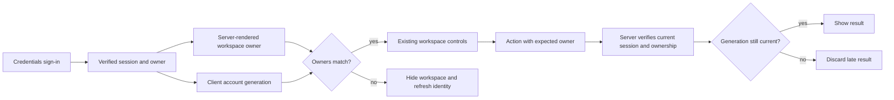

# Portfolio UI and account boundary

The shared design layer adapts the measured Lovable dashboard tokens without replacing Blindspot's product structure. Imported token/component CSS stays intact. Local mappings give existing cards, tables, controls, badges and charts semantic light/dark colors. Inter variable and Roboto Mono are self-hosted with their original OFL notices; Lucide supplies navigation and account icons. There is no generated-media requirement for this data workspace.

The existing sidebar, route detail, evidence and golden-set layouts remain. On compact screens the sidebar becomes a horizontally scrollable named navigation row. Dense tables scroll inside their cards; grid children may shrink. The account header stays separate from route controls.

## Account transitions

Auth.js Credentials is the login authority; the backend checks database revocation. The client reads `/api/session`, and signup uses a signed anonymous CSRF token before a session exists; authenticated tokens bind to the session ID. A server-rendered workspace receives its verified owner ID, and is only visible while the current client session matches. Signing out or receiving a cross-tab account-change notification invalidates pending work synchronously. Successful login and logout use full document navigation to discard the previous session's Next router cache. Session-service failure hides protected content until recovery.

All invoked workspace Server Actions receive the rendered owner as their final argument. The backend treats it as a mismatch guard, never as authority. A generation fence rejects late action results, minted SDK keys, provider-key state and delayed dataset/context reads after account change or unmount. Current-session expiry hides the workspace; an old request cannot expire a newer account. Same-account refresh preserves valid work. Forms and sensitive drawers are remounted on identity changes, and no private workspace drafts or keys are persisted in browser storage. Only theme and a content-free account-change signal are stored.

The rejected alternative was using only layout-level login checks or a current cookie at dispatch: a delayed A form could otherwise mutate B's objectless settings after a shared-cookie account switch. Authorization remains server-side even if the client guard is bypassed.

## Honest examples and evidence

Try with an example invokes a server action and creates the owner-scoped prepared workflow through the actual shipped SDK and the normal evaluation persistence path, using fixed responses and judgments. The client does not fabricate traces, scores or SDK keys. The persisted prepared marker travels with workflow/route/evaluation views; those records are read-only and remain free. Mutation controls are disabled while evidence links remain active. A display-only formatter hides the internal namespace UUID only for prepared records. Ordinary names, stored IDs, request arguments and URLs are unchanged. No prepared score is a paid model-quality proof.

The UI retains the difference between observed nodes and static topology, model-only screening and workflow replay, managed application and observe-only approval. Auto-approval is not enabled by the design update.

## Verification status

Original mocked core loop and integrated local browser gates are accepted. Twelve focused client regressions pass. Root verified actual signup/signin/signout, prepared traces/evals, Monitor, disabled prepared controls, concise labels and desktop dark / 390 px light layouts without browser errors or provider calls. Live AWS free acceptance passed 13 groups/33 requests and root browser checks. One ordinary paid SDK completion passed and its metadata span appeared in Monitor: 16 input/5 output tokens, estimated USD 0.0000054. The visible 0.001 cents is rounded from stored 0.00054 cents. No paid judge or evaluation ran; fixed prepared 90% scores remain illustrative. Final read-only audit confirmed the usage row and SDK span were unchanged; root verified the live Monitor with no console errors. Google OAuth and password recovery are unavailable. Provider credentials remain masked; newly minted SDK keys have a shown-once panel and explicit Hide key control.

Golden imports accept files up to 400 KiB and check the aggregate serialized JSON payload at 512 KiB before any server dispatch, counting UTF-8 and escaping. The Next transport cap stays 1 MiB. Draft generation accepts whole counts from 1 to 20. Oversized requests receive a visible reduction instruction.
