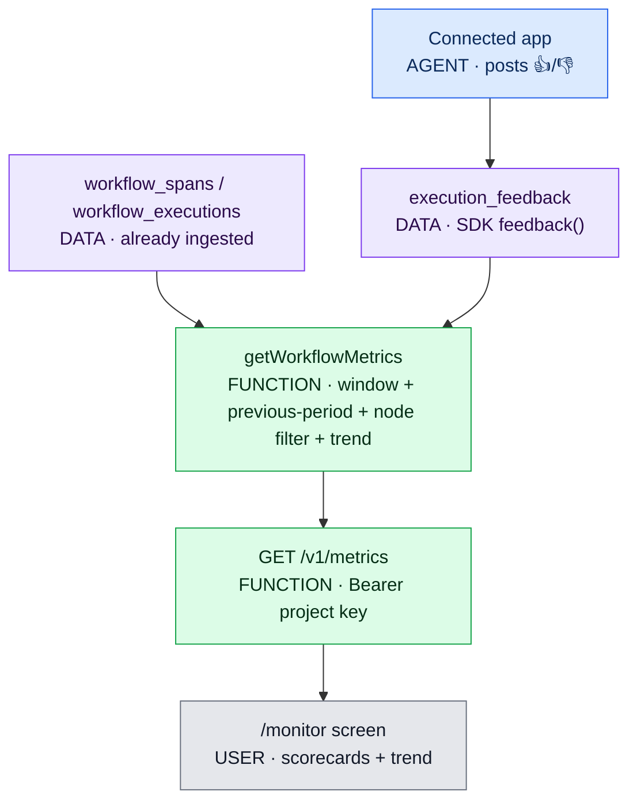

# Monitor (Slice 1) Implementation Plan

> **For agentic workers:** REQUIRED SUB-SKILL: Use superpowers:subagent-driven-development (recommended) or superpowers:executing-plans to implement this plan task-by-task. Steps use checkbox (`- [ ]`) syntax for tracking.

**Goal:** Add an operational **Monitor** surface — latency, cost, workflow-failure, no-answer, volume, and end-user feedback — sliced by 7/30/90-day windows with previous-period comparison, a monthly trend, and a node filter, on top of data Blindspot already ingests.

**Architecture:** A new read-only `metrics` service in `@blindspot/core` aggregates existing `workflow_spans` / `workflow_executions` / `traces` plus one new additive `execution_feedback` table. The gateway exposes `GET /v1/metrics` (dashboard-read) and `POST /v1/feedback` (SDK-write); the SDK gains a best-effort `feedback()` method; the dashboard gains a `/monitor` server-component screen and a nav item. Nothing on the app's live request path changes.

**Tech Stack:** TypeScript · pnpm + Turborepo · Drizzle ORM (Postgres, `postgres-js`) · Hono (gateway) · Zod (`@blindspot/shared`) · Next.js 15 App Router (dashboard) · `tsx` + `node:assert/strict` integration tests.

## Global Constraints

- **Money is USD cents** everywhere; latency is integer ms. Match existing column/field conventions.
- **Metadata-safe by default:** end-user feedback is app-supplied; only the optional `comment` is content. Never require or auto-enable `inputs`/`full` capture for any Monitor metric.
- **New Zod schemas** go in `packages/shared/src/schemas.ts` (auto-exported by `packages/shared/src/index.ts`). **New core services** are re-exported from `packages/core/src/index.ts`. **New gateway routers** are mounted in `apps/gateway/src/index.ts` with `app.route("/v1", …)`.
- **DB migrations:** run `pnpm --filter @blindspot/db db:generate` to write the SQL, then `pnpm --filter @blindspot/db db:push` to apply to the **dev** DB in the git-ignored `.env`. **Production (Render) migration is a separate manual step — do NOT assume deploy applies it.**
- **Commits are LOCAL checkpoints.** Do **not** push to `origin/main` without explicit user approval — `main` auto-deploys to Render.
- **Node filter semantics (avoid ambiguity):** a selected node narrows **latency, cost, and error-rate** (span-derived). **Failure rate, no-answer rate, and feedback stay workflow-level** regardless of node filter (they are execution/workflow concepts). The UI must state this.
- **Never print secrets.** Read config from `process.env` only.
- Verification baseline that must stay green: `pnpm typecheck && pnpm test:auth-origin && pnpm test:eval-plan && pnpm build`.

---

## File Structure

- `packages/db/src/schema.ts` — **modify**: add `executionFeedbackKind` enum + `executionFeedback` table.
- `packages/db/drizzle/000N_*.sql` — **create** (generated): additive migration.
- `packages/shared/src/schemas.ts` — **modify**: `MetricsWindowSchema`, `ExecutionFeedbackKindSchema`, `ExecutionFeedbackInputSchema` (+ inferred types).
- `packages/core/src/execution-feedback.ts` — **create**: `recordExecutionFeedback()`.
- `packages/core/src/metrics.ts` — **create**: `getWorkflowMetrics()` + private aggregate helpers + exported types.
- `packages/core/src/index.ts` — **modify**: re-export the two new modules.
- `scripts/test-metrics.ts` — **create**: integration test (real DB, cleanup in `finally`).
- `package.json` (root) — **modify**: add `test:metrics` script.
- `apps/gateway/src/manage/monitor.ts` — **create**: `monitorRouter` with `GET /metrics` and `POST /feedback`.
- `apps/gateway/src/index.ts` — **modify**: mount `monitorRouter`; add `"monitor-v1"` to `/healthz` features.
- `packages/sdk/src/index.ts` — **modify**: add `feedback()` method.
- `apps/dashboard/lib/types.ts` — **modify**: add `MetricPoint`, `TrendBucket`, `WorkflowMetrics`, `MonitorNode` types.
- `apps/dashboard/lib/api.ts` — **modify**: add `metrics()` client method.
- `apps/dashboard/components/charts.tsx` — **modify**: add `TrendChart`.
- `apps/dashboard/app/(app)/monitor/page.tsx` — **create**: the Monitor screen (server component, reads `searchParams`).
- `apps/dashboard/components/Sidebar.tsx` — **modify**: add the Monitor nav item.
- `docs/mermaid/09-monitor-metrics.mmd` — **create**; regenerate `docs/architecture-flow.html`.
- `Loop.MD`, `Handoff.MD` — **modify**: register `test:metrics` in Rung 1; snapshot handoff.

---

### Task 1: `execution_feedback` table + migration

**Files:**
- Modify: `packages/db/src/schema.ts`
- Create: `packages/db/drizzle/000N_*.sql` (generated)

**Interfaces:**
- Produces: table `executionFeedback` with columns `id, projectId, workflowId(nullable), executionExternalId, nodeName(nullable), kind('up'|'down'|'score'), value(real,nullable), comment(text,nullable), createdAt`; enum `executionFeedbackKind`.

- [ ] **Step 1: Add the enum + table to the schema**

In `packages/db/src/schema.ts`, add next to the other `bs.enum` declarations:

```typescript
export const executionFeedbackKind = bs.enum("execution_feedback_kind", [
  "up",
  "down",
  "score",
]);
```

And add this table after `workflowSpans` (end of file):

```typescript
/**
 * End-user feedback on an agent execution (👍/👎/score). App-supplied and metadata-safe:
 * only the optional `comment` is content. Linked to a workflow by name+environment at write
 * time; `executionExternalId` is the app's own execution id (matches workflowExecutions.externalId).
 */
export const executionFeedback = bs.table(
  "execution_feedback",
  {
    id: uuid("id").primaryKey().defaultRandom(),
    projectId: uuid("project_id")
      .notNull()
      .references(() => projects.id, { onDelete: "cascade" }),
    workflowId: uuid("workflow_id").references(() => workflows.id, { onDelete: "set null" }),
    executionExternalId: text("execution_external_id").notNull(),
    nodeName: text("node_name"),
    kind: executionFeedbackKind("kind").notNull(),
    value: real("value"),
    comment: text("comment"),
    createdAt: createdAt(),
  },
  (t) => [
    index("execution_feedback_project_created_idx").on(t.projectId, t.createdAt),
    index("execution_feedback_workflow_created_idx").on(t.workflowId, t.createdAt),
  ],
);
```

- [ ] **Step 2: Generate the migration**

Run: `pnpm --filter @blindspot/db db:generate`
Expected: a new `packages/db/drizzle/000N_*.sql` creating `blindspot.execution_feedback` and the enum. It must be **additive only** (no `DROP`/`ALTER` of existing tables). Inspect the file to confirm.

- [ ] **Step 3: Apply to the dev database**

Run: `pnpm --filter @blindspot/db db:push`
Expected: applies cleanly to the `DATABASE_URL` in `.env`. (Production/Render apply is a separate manual step — note it, do not run it here.)

- [ ] **Step 4: Typecheck**

Run: `pnpm --filter @blindspot/db typecheck`
Expected: PASS.

- [ ] **Step 5: Commit (local)**

```bash
git add packages/db/src/schema.ts packages/db/drizzle
git commit -m "feat(db): add execution_feedback table for end-user feedback"
```

---

### Task 2: Shared Zod schemas (metrics window + feedback input)

**Files:**
- Modify: `packages/shared/src/schemas.ts`

**Interfaces:**
- Produces: `MetricsWindowSchema`/`MetricsWindow` (`"7d"|"30d"|"90d"`); `ExecutionFeedbackKindSchema`; `ExecutionFeedbackInputSchema`/`ExecutionFeedbackInput` (`{ workflow:{name,environment}, executionId, nodeName?, kind, value?, comment? }`).

- [ ] **Step 1: Add the schemas** (append to `packages/shared/src/schemas.ts`)

```typescript
/** The dashboard's operational reporting windows (each compared to the prior equal period). */
export const MetricsWindowSchema = z.enum(["7d", "30d", "90d"]);
export type MetricsWindow = z.infer<typeof MetricsWindowSchema>;

export const ExecutionFeedbackKindSchema = z.enum(["up", "down", "score"]);
export type ExecutionFeedbackKind = z.infer<typeof ExecutionFeedbackKindSchema>;

/** Reuse the credential guard so a pasted key never lands in a free-text comment. */
export const ExecutionFeedbackInputSchema = z
  .object({
    workflow: z.object({
      name: z.string().trim().min(1).max(120),
      environment: z.string().trim().min(1).max(40).default("production"),
    }),
    executionId: z.string().trim().min(1).max(200),
    nodeName: z.string().trim().min(1).max(160).optional(),
    kind: ExecutionFeedbackKindSchema,
    value: z.number().min(0).max(1).optional(),
    comment: z.string().trim().max(2_000).optional(),
  })
  .superRefine((value, ctx) => {
    if (value.kind === "score" && value.value === undefined) {
      ctx.addIssue({ code: z.ZodIssueCode.custom, message: "kind 'score' requires a value" });
    }
    if (value.comment && FEEDBACK_CREDENTIAL.test(value.comment)) {
      ctx.addIssue({
        code: z.ZodIssueCode.custom,
        message: "feedback comment looks like it contains a credential; redact it and try again",
      });
    }
  });
export type ExecutionFeedbackInput = z.infer<typeof ExecutionFeedbackInputSchema>;
```

> `FEEDBACK_CREDENTIAL` is already declared earlier in this file (used by `BetaFeedbackInputSchema`). This new schema reuses it, so it must be added **after** that declaration (append at end of file).

- [ ] **Step 2: Typecheck**

Run: `pnpm --filter @blindspot/shared typecheck`
Expected: PASS.

- [ ] **Step 3: Commit (local)**

```bash
git add packages/shared/src/schemas.ts
git commit -m "feat(shared): metrics window + execution feedback schemas"
```

---

### Task 3: `recordExecutionFeedback` core service

**Files:**
- Create: `packages/core/src/execution-feedback.ts`
- Modify: `packages/core/src/index.ts`

**Interfaces:**
- Consumes: `ExecutionFeedbackInput` (Task 2), `executionFeedback`/`workflows` tables (Task 1).
- Produces: `recordExecutionFeedback(projectId: string, input: ExecutionFeedbackInput): Promise<{ id: string }>` — resolves `workflowId` from `(projectId, name, environment)` when the workflow exists, else stores with `workflowId: null`.

- [ ] **Step 1: Write the service**

Create `packages/core/src/execution-feedback.ts`:

```typescript
import { and, eq } from "drizzle-orm";
import { executionFeedback, getDb, workflows } from "@blindspot/db";
import { ExecutionFeedbackInputSchema, type ExecutionFeedbackInput } from "@blindspot/shared";

/**
 * Store one end-user feedback event. App-supplied and best-effort: it links to a workflow
 * when that workflow already exists (spans arrive first), otherwise it is retained unlinked.
 */
export async function recordExecutionFeedback(
  projectId: string,
  rawInput: ExecutionFeedbackInput,
): Promise<{ id: string }> {
  const input = ExecutionFeedbackInputSchema.parse(rawInput);
  const db = getDb();
  const workflow = (
    await db
      .select({ id: workflows.id })
      .from(workflows)
      .where(
        and(
          eq(workflows.projectId, projectId),
          eq(workflows.name, input.workflow.name),
          eq(workflows.environment, input.workflow.environment),
        ),
      )
      .limit(1)
  )[0];
  const row = (
    await db
      .insert(executionFeedback)
      .values({
        projectId,
        workflowId: workflow?.id ?? null,
        executionExternalId: input.executionId,
        nodeName: input.nodeName ?? null,
        kind: input.kind,
        value: input.kind === "score" ? (input.value ?? null) : null,
        comment: input.comment ?? null,
      })
      .returning({ id: executionFeedback.id })
  )[0]!;
  return { id: row.id };
}
```

- [ ] **Step 2: Re-export it**

In `packages/core/src/index.ts` add (with the other exports):

```typescript
export * from "./execution-feedback";
export * from "./metrics";
```

> `./metrics` is created in Task 4; adding both exports now keeps this a single edit. If `./metrics` does not exist yet, complete Task 4 before running the core typecheck.

- [ ] **Step 3: Commit (local)** (after Task 4 exists, so `./metrics` resolves — or temporarily omit the metrics line and add it in Task 4). For a clean single commit, defer the commit to the end of Task 4.

---

### Task 4: `metrics` service + integration test

**Files:**
- Create: `packages/core/src/metrics.ts`
- Create: `scripts/test-metrics.ts`
- Modify: `package.json` (root)

**Interfaces:**
- Consumes: `workflowExecutions`, `workflowSpans`, `workflowNodes`, `executionFeedback`, `workflows` tables; `MetricsWindow` (Task 2).
- Produces:
  - `getWorkflowMetrics(projectId: string, opts: { workflowId: string; nodeId?: string | null; window: MetricsWindow; now?: Date }): Promise<WorkflowMetrics>`
  - Types `MetricPoint { current: number|null; previous: number|null; deltaPct: number|null }`, `TrendBucket`, `WorkflowMetrics`, `MonitorNode`.

- [ ] **Step 1: Write the failing test**

Create `scripts/test-metrics.ts`:

```typescript
import assert from "node:assert/strict";
import { randomUUID } from "node:crypto";
import { eq } from "drizzle-orm";
import {
  executionFeedback,
  getDb,
  projects,
  workflowExecutions,
  workflowNodes,
  workflowSpans,
  workflows,
} from "@blindspot/db";
import { getWorkflowMetrics, recordExecutionFeedback } from "@blindspot/core";
import { loadRootEnv } from "@blindspot/shared";

loadRootEnv(import.meta.url);

const HAIKU = "anthropic:claude-haiku-4-5-20251001";

/** Insert one execution with a single generation span at an explicit time. */
async function seedExecution(
  db: ReturnType<typeof getDb>,
  args: {
    workflowId: string;
    nodeId: string;
    at: Date;
    status: "completed" | "error" | "running";
    latencyMs: number;
    costCents: number;
    spanStatus?: "ok" | "error";
  },
) {
  const externalId = `exec-${randomUUID()}`;
  const execution = (
    await db
      .insert(workflowExecutions)
      .values({
        workflowId: args.workflowId,
        externalId,
        status: args.status,
        startedAt: args.at,
        endedAt: args.status === "running" ? null : new Date(args.at.getTime() + args.latencyMs),
      })
      .returning()
  )[0]!;
  await db.insert(workflowSpans).values({
    executionId: execution.id,
    nodeId: args.nodeId,
    externalId: `span-${randomUUID()}`,
    model: HAIKU,
    status: args.spanStatus ?? (args.status === "error" ? "error" : "ok"),
    captureMode: "metadata",
    latencyMs: args.latencyMs,
    costCents: args.costCents,
    startedAt: args.at,
    endedAt: new Date(args.at.getTime() + args.latencyMs),
  });
  return externalId;
}

async function main() {
  const db = getDb();
  const now = new Date("2026-07-22T12:00:00.000Z");
  const day = 24 * 60 * 60 * 1000;
  const inWindow = new Date(now.getTime() - 2 * day); // inside the last 7 days
  const inPrevWindow = new Date(now.getTime() - 9 * day); // inside the prior 7 days

  const project = (
    await db
      .insert(projects)
      .values({ userId: `metrics-test-${randomUUID()}`, name: "Metrics test" })
      .returning()
  )[0]!;

  try {
    const workflow = (
      await db
        .insert(workflows)
        .values({ projectId: project.id, name: "metrics-wf", environment: "test" })
        .returning()
    )[0]!;
    const node = (
      await db
        .insert(workflowNodes)
        .values({
          workflowId: workflow.id,
          name: "answer",
          kind: "generation",
          latestModel: HAIKU,
          requirementsJson: {
            inputModalities: ["text"],
            outputModalities: ["text"],
            toolCalling: false,
            structuredOutput: false,
            streaming: false,
            systemMessages: false,
          },
        })
        .returning()
    )[0]!;

    // current window: 2 completed (100ms, 300ms) + 1 error; previous window: 1 completed (200ms)
    await seedExecution(db, { workflowId: workflow.id, nodeId: node.id, at: inWindow, status: "completed", latencyMs: 100, costCents: 0.01 });
    await seedExecution(db, { workflowId: workflow.id, nodeId: node.id, at: inWindow, status: "completed", latencyMs: 300, costCents: 0.03 });
    await seedExecution(db, { workflowId: workflow.id, nodeId: node.id, at: inWindow, status: "error", latencyMs: 50, costCents: 0.0, spanStatus: "error" });
    const prevExec = await seedExecution(db, { workflowId: workflow.id, nodeId: node.id, at: inPrevWindow, status: "completed", latencyMs: 200, costCents: 0.02 });

    // feedback: 3 up, 1 down in the current window (via the service, to test workflow linking)
    for (const kind of ["up", "up", "up", "down"] as const) {
      await recordExecutionFeedback(project.id, {
        workflow: { name: "metrics-wf", environment: "test" },
        executionId: `fb-${randomUUID()}`,
        kind,
      });
    }
    // Backdate one feedback row into the previous window so deltas are exercised.
    await db
      .update(executionFeedback)
      .set({ createdAt: inPrevWindow })
      .where(eq(executionFeedback.executionExternalId, prevExec));

    const m = await getWorkflowMetrics(project.id, { workflowId: workflow.id, window: "7d", now });

    assert.equal(m.executions.current, 3, "current window has 3 executions");
    assert.equal(m.executions.previous, 1, "previous window has 1 execution");
    assert.equal(Math.round(m.failureRatePct.current ?? -1), 33, "1 of 3 executions failed");
    assert.equal(m.avgLatencyMs.current, 200, "avg of 100 and 300 (errors excluded) = 200");
    assert.ok((m.p95LatencyMs.current ?? 0) >= 200, "p95 reflects the tail");
    assert.ok(Math.abs((m.costCents.current ?? 0) - 0.04) < 1e-9, "cost sums span costs");
    assert.equal(m.feedbackScorePct.current, 75, "3 up of 4 = 75%");
    assert.ok(m.trend.length >= 1, "monthly trend is populated");
    assert.ok(m.nodes.some((n) => n.name === "answer"), "node filter list includes the node");

    // node filter narrows latency/cost/errors to the node (same values here, one node)
    const scoped = await getWorkflowMetrics(project.id, {
      workflowId: workflow.id,
      nodeId: node.id,
      window: "7d",
      now,
    });
    assert.equal(scoped.avgLatencyMs.current, 200, "node-scoped latency matches");

    console.log(JSON.stringify({ passed: true, executions: m.executions, feedbackScorePct: m.feedbackScorePct.current }));
  } finally {
    await db.delete(projects).where(eq(projects.id, project.id));
  }
}

main()
  .then(() => process.exit(0))
  .catch((error) => {
    console.error(error instanceof Error ? error.message : "metrics integration test failed");
    process.exit(1);
  });
```

- [ ] **Step 2: Add the test script to root `package.json`**

In root `package.json` `scripts`, add after `test:eval-plan`:

```json
"test:metrics": "pnpm --filter @blindspot/sdk build && tsx scripts/test-metrics.ts",
```

- [ ] **Step 3: Run the test to verify it fails**

Run: `pnpm test:metrics`
Expected: FAIL — `getWorkflowMetrics` is not exported yet (module `./metrics` missing).

- [ ] **Step 4: Implement the metrics service**

Create `packages/core/src/metrics.ts`:

```typescript
import { and, eq, gte, lt, sql } from "drizzle-orm";
import {
  executionFeedback,
  getDb,
  workflowExecutions,
  workflowNodes,
  workflowSpans,
} from "@blindspot/db";
import type { MetricsWindow } from "@blindspot/shared";

export interface MetricPoint {
  current: number | null;
  previous: number | null;
  /** (current - previous) / previous * 100; null when previous is 0 or null. */
  deltaPct: number | null;
}

export interface TrendBucket {
  month: string; // "YYYY-MM"
  executions: number;
  failures: number;
  avgLatencyMs: number | null;
  costCents: number;
  feedbackUp: number;
  feedbackDown: number;
}

export interface MonitorNode {
  id: string;
  name: string;
  kind: string;
}

export interface WorkflowMetrics {
  window: MetricsWindow;
  workflowId: string;
  nodeId: string | null;
  executions: MetricPoint; // volume
  failureRatePct: MetricPoint; // A.2 — executions with status='error' / total
  noAnswerRatePct: MetricPoint; // A.3 — executions not 'completed' / total (app-signaled)
  avgLatencyMs: MetricPoint;
  p95LatencyMs: MetricPoint;
  costCents: MetricPoint; // A.4 total
  feedbackScorePct: MetricPoint; // A.5 — up / (up+down)
  trend: TrendBucket[];
  nodes: MonitorNode[];
}

const WINDOW_DAYS: Record<MetricsWindow, number> = { "7d": 7, "30d": 30, "90d": 90 };

function windowRange(window: MetricsWindow, now: Date) {
  const ms = WINDOW_DAYS[window] * 24 * 60 * 60 * 1000;
  return {
    start: new Date(now.getTime() - ms),
    end: now,
    prevStart: new Date(now.getTime() - 2 * ms),
    prevEnd: new Date(now.getTime() - ms),
  };
}

function point(current: number | null, previous: number | null): MetricPoint {
  const deltaPct =
    previous == null || previous === 0 || current == null
      ? null
      : ((current - previous) / previous) * 100;
  return { current, previous, deltaPct };
}

/** Execution-level aggregates for a workflow over [start, end). */
async function executionAggregates(workflowId: string, start: Date, end: Date) {
  const db = getDb();
  const row = (
    await db
      .select({
        executions: sql<number>`count(*)::int`,
        failures: sql<number>`count(*) filter (where ${workflowExecutions.status} = 'error')::int`,
        noAnswer: sql<number>`count(*) filter (where ${workflowExecutions.status} <> 'completed')::int`,
      })
      .from(workflowExecutions)
      .where(
        and(
          eq(workflowExecutions.workflowId, workflowId),
          gte(workflowExecutions.startedAt, start),
          lt(workflowExecutions.startedAt, end),
        ),
      )
  )[0]!;
  const executions = row.executions ?? 0;
  return {
    executions,
    failureRatePct: executions === 0 ? null : (row.failures / executions) * 100,
    noAnswerRatePct: executions === 0 ? null : (row.noAnswer / executions) * 100,
  };
}

/** Span-level latency/cost aggregates. Scoped to a node when nodeId is provided; otherwise the
 *  whole workflow (spans joined through executions). Errored spans are excluded from latency. */
async function spanAggregates(
  workflowId: string,
  nodeId: string | null,
  start: Date,
  end: Date,
) {
  const db = getDb();
  const filters = [gte(workflowSpans.startedAt, start), lt(workflowSpans.startedAt, end)];
  const query = db
    .select({
      avgLatencyMs: sql<number | null>`avg(${workflowSpans.latencyMs}) filter (where ${workflowSpans.status} = 'ok')::float`,
      p95LatencyMs: sql<number | null>`percentile_cont(0.95) within group (order by ${workflowSpans.latencyMs}) filter (where ${workflowSpans.status} = 'ok')::float`,
      costCents: sql<number>`coalesce(sum(${workflowSpans.costCents}), 0)::float`,
    })
    .from(workflowSpans);
  if (nodeId) {
    filters.unshift(eq(workflowSpans.nodeId, nodeId));
    const row = (await query.where(and(...filters)))[0]!;
    return row;
  }
  // whole-workflow: join spans → executions to scope by workflow
  const row = (
    await db
      .select({
        avgLatencyMs: sql<number | null>`avg(${workflowSpans.latencyMs}) filter (where ${workflowSpans.status} = 'ok')::float`,
        p95LatencyMs: sql<number | null>`percentile_cont(0.95) within group (order by ${workflowSpans.latencyMs}) filter (where ${workflowSpans.status} = 'ok')::float`,
        costCents: sql<number>`coalesce(sum(${workflowSpans.costCents}), 0)::float`,
      })
      .from(workflowSpans)
      .innerJoin(workflowExecutions, eq(workflowSpans.executionId, workflowExecutions.id))
      .where(
        and(
          eq(workflowExecutions.workflowId, workflowId),
          gte(workflowSpans.startedAt, start),
          lt(workflowSpans.startedAt, end),
        ),
      )
  )[0]!;
  return row;
}

/** Feedback up/down counts for a workflow over [start, end). Always workflow-level. */
async function feedbackAggregates(workflowId: string, start: Date, end: Date) {
  const db = getDb();
  const row = (
    await db
      .select({
        up: sql<number>`count(*) filter (where ${executionFeedback.kind} = 'up')::int`,
        down: sql<number>`count(*) filter (where ${executionFeedback.kind} = 'down')::int`,
      })
      .from(executionFeedback)
      .where(
        and(
          eq(executionFeedback.workflowId, workflowId),
          gte(executionFeedback.createdAt, start),
          lt(executionFeedback.createdAt, end),
        ),
      )
  )[0]!;
  const total = row.up + row.down;
  return { scorePct: total === 0 ? null : (row.up / total) * 100 };
}

async function monthlyTrend(workflowId: string, since: Date): Promise<TrendBucket[]> {
  const db = getDb();
  const execRows = await db
    .select({
      month: sql<string>`to_char(date_trunc('month', ${workflowExecutions.startedAt}), 'YYYY-MM')`,
      executions: sql<number>`count(*)::int`,
      failures: sql<number>`count(*) filter (where ${workflowExecutions.status} = 'error')::int`,
    })
    .from(workflowExecutions)
    .where(and(eq(workflowExecutions.workflowId, workflowId), gte(workflowExecutions.startedAt, since)))
    .groupBy(sql`date_trunc('month', ${workflowExecutions.startedAt})`)
    .orderBy(sql`date_trunc('month', ${workflowExecutions.startedAt})`);
  const spanRows = await db
    .select({
      month: sql<string>`to_char(date_trunc('month', ${workflowSpans.startedAt}), 'YYYY-MM')`,
      avgLatencyMs: sql<number | null>`avg(${workflowSpans.latencyMs}) filter (where ${workflowSpans.status} = 'ok')::float`,
      costCents: sql<number>`coalesce(sum(${workflowSpans.costCents}), 0)::float`,
    })
    .from(workflowSpans)
    .innerJoin(workflowExecutions, eq(workflowSpans.executionId, workflowExecutions.id))
    .where(and(eq(workflowExecutions.workflowId, workflowId), gte(workflowSpans.startedAt, since)))
    .groupBy(sql`date_trunc('month', ${workflowSpans.startedAt})`);
  const fbRows = await db
    .select({
      month: sql<string>`to_char(date_trunc('month', ${executionFeedback.createdAt}), 'YYYY-MM')`,
      up: sql<number>`count(*) filter (where ${executionFeedback.kind} = 'up')::int`,
      down: sql<number>`count(*) filter (where ${executionFeedback.kind} = 'down')::int`,
    })
    .from(executionFeedback)
    .where(and(eq(executionFeedback.workflowId, workflowId), gte(executionFeedback.createdAt, since)))
    .groupBy(sql`date_trunc('month', ${executionFeedback.createdAt})`);

  const spanByMonth = new Map(spanRows.map((r) => [r.month, r]));
  const fbByMonth = new Map(fbRows.map((r) => [r.month, r]));
  return execRows.map((r) => ({
    month: r.month,
    executions: r.executions,
    failures: r.failures,
    avgLatencyMs: spanByMonth.get(r.month)?.avgLatencyMs ?? null,
    costCents: spanByMonth.get(r.month)?.costCents ?? 0,
    feedbackUp: fbByMonth.get(r.month)?.up ?? 0,
    feedbackDown: fbByMonth.get(r.month)?.down ?? 0,
  }));
}

export async function getWorkflowMetrics(
  projectId: string,
  opts: { workflowId: string; nodeId?: string | null; window: MetricsWindow; now?: Date },
): Promise<WorkflowMetrics> {
  const db = getDb();
  const now = opts.now ?? new Date();
  const nodeId = opts.nodeId ?? null;
  const { start, end, prevStart, prevEnd } = windowRange(opts.window, now);

  const [
    curExec,
    prevExec,
    curSpan,
    prevSpan,
    curFb,
    prevFb,
    trend,
    nodeRows,
  ] = await Promise.all([
    executionAggregates(opts.workflowId, start, end),
    executionAggregates(opts.workflowId, prevStart, prevEnd),
    spanAggregates(opts.workflowId, nodeId, start, end),
    spanAggregates(opts.workflowId, nodeId, prevStart, prevEnd),
    feedbackAggregates(opts.workflowId, start, end),
    feedbackAggregates(opts.workflowId, prevStart, prevEnd),
    monthlyTrend(opts.workflowId, new Date(now.getTime() - 365 * 24 * 60 * 60 * 1000)),
    db
      .select({ id: workflowNodes.id, name: workflowNodes.name, kind: workflowNodes.kind })
      .from(workflowNodes)
      .where(eq(workflowNodes.workflowId, opts.workflowId)),
  ]);

  return {
    window: opts.window,
    workflowId: opts.workflowId,
    nodeId,
    executions: point(curExec.executions, prevExec.executions),
    failureRatePct: point(curExec.failureRatePct, prevExec.failureRatePct),
    noAnswerRatePct: point(curExec.noAnswerRatePct, prevExec.noAnswerRatePct),
    avgLatencyMs: point(curSpan.avgLatencyMs ?? null, prevSpan.avgLatencyMs ?? null),
    p95LatencyMs: point(curSpan.p95LatencyMs ?? null, prevSpan.p95LatencyMs ?? null),
    costCents: point(curSpan.costCents ?? 0, prevSpan.costCents ?? 0),
    feedbackScorePct: point(curFb.scorePct, prevFb.scorePct),
    trend,
    nodes: nodeRows.map((n) => ({ id: n.id, name: n.name, kind: n.kind })),
  };
}
```

- [ ] **Step 5: Run the test to verify it passes**

Run: `pnpm test:metrics`
Expected: PASS — prints `{"passed":true,...}`. If `avgLatencyMs` assertions fail, confirm errored spans are excluded via the `filter (where status = 'ok')` clauses.

- [ ] **Step 6: Typecheck core**

Run: `pnpm --filter @blindspot/core typecheck`
Expected: PASS (this also validates the Task 3 `./metrics` re-export).

- [ ] **Step 7: Commit (local)**

```bash
git add packages/core/src/execution-feedback.ts packages/core/src/metrics.ts packages/core/src/index.ts scripts/test-metrics.ts package.json
git commit -m "feat(core): windowed workflow metrics service + feedback recorder + test"
```

---

### Task 5: Gateway endpoints (`GET /v1/metrics`, `POST /v1/feedback`)

**Files:**
- Create: `apps/gateway/src/manage/monitor.ts`
- Modify: `apps/gateway/src/index.ts`

**Interfaces:**
- Consumes: `getWorkflowMetrics`, `recordExecutionFeedback` (core); `MetricsWindowSchema`, `ExecutionFeedbackInputSchema` (shared).
- Produces: `monitorRouter` (Hono). `GET /v1/metrics?workflowId&nodeId&window` → `WorkflowMetrics`. `POST /v1/feedback` (body = `ExecutionFeedbackInput`) → `{ feedback: { id } }`.

- [ ] **Step 1: Write the router**

Create `apps/gateway/src/manage/monitor.ts`:

```typescript
import { Hono } from "hono";
import { getWorkflowMetrics, recordExecutionFeedback } from "@blindspot/core";
import { ExecutionFeedbackInputSchema, MetricsWindowSchema } from "@blindspot/shared";
import type { Env } from "../types";

export const monitorRouter = new Hono<Env>();

// Dashboard-read: operational metrics for one workflow (+ optional node), windowed.
monitorRouter.get("/metrics", async (c) => {
  const workflowId = c.req.query("workflowId");
  if (!workflowId) {
    return c.json({ error: { message: "workflowId is required" } }, 400);
  }
  const window = MetricsWindowSchema.catch("7d").parse(c.req.query("window"));
  const nodeId = c.req.query("nodeId") || null;
  return c.json(await getWorkflowMetrics(c.get("projectId"), { workflowId, nodeId, window }));
});

// SDK-write: one end-user feedback event (👍/👎/score). Metadata-safe; comment is optional.
monitorRouter.post("/feedback", async (c) => {
  const parsed = ExecutionFeedbackInputSchema.safeParse(await c.req.json().catch(() => null));
  if (!parsed.success) {
    return c.json(
      { error: { message: parsed.error.issues[0]?.message ?? "invalid feedback" } },
      400,
    );
  }
  return c.json({ feedback: await recordExecutionFeedback(c.get("projectId"), parsed.data) }, 201);
});
```

- [ ] **Step 2: Mount it + advertise the feature**

In `apps/gateway/src/index.ts`:
- Add the import with the other manage routers: `import { monitorRouter } from "./manage/monitor";`
- Add to the `/healthz` `features` array: `"monitor-v1"`.
- Add after the other `app.route("/v1", …)` lines: `app.route("/v1", monitorRouter);`

- [ ] **Step 3: Typecheck the gateway**

Run: `pnpm --filter @blindspot/gateway typecheck`
Expected: PASS.

- [ ] **Step 4: Smoke-test locally** (requires `.env` with `DATABASE_URL`)

Run: `pnpm start:gateway` in one terminal, then in another:
`curl -s localhost:8787/healthz | grep monitor-v1`
Expected: `/healthz` lists `monitor-v1`. (`/v1/metrics` needs a real project key; covered by the dashboard task.)

- [ ] **Step 5: Commit (local)**

```bash
git add apps/gateway/src/manage/monitor.ts apps/gateway/src/index.ts
git commit -m "feat(gateway): metrics read + end-user feedback write endpoints"
```

---

### Task 6: SDK `feedback()` method

**Files:**
- Modify: `packages/sdk/src/index.ts`

**Interfaces:**
- Produces: `Blindspot.feedback(input: { executionId: string; nodeName?: string; kind: "up" | "down" | "score"; value?: number; comment?: string }): Promise<boolean>` — best-effort POST to `/v1/feedback`, using the SDK's configured `workflow`/`environment`.

- [ ] **Step 1: Add the method** (inside the `Blindspot` class in `packages/sdk/src/index.ts`, after `shareContext`)

```typescript
  /**
   * Record one end-user feedback event (👍/👎/score) for an execution. Best-effort and
   * metadata-safe: only an optional comment is content. Never throws into the host app.
   */
  async feedback(input: {
    executionId: string;
    nodeName?: string;
    kind: "up" | "down" | "score";
    value?: number;
    comment?: string;
  }): Promise<boolean> {
    if (!this.enabled) return false;
    const controller = new AbortController();
    const timeout = setTimeout(() => controller.abort(), 5_000);
    timeout.unref?.();
    try {
      const response = await fetch(apiEndpoint(this.config.baseUrl!, "/feedback"), {
        method: "POST",
        headers: {
          authorization: `Bearer ${this.config.apiKey}`,
          "content-type": "application/json",
        },
        body: JSON.stringify({
          workflow: { name: this.config.workflow, environment: this.config.environment },
          executionId: input.executionId,
          nodeName: input.nodeName,
          kind: input.kind,
          value: input.value,
          comment: input.comment,
        }),
        signal: controller.signal,
      });
      if (!response.ok) throw new Error(`Blindspot feedback returned ${response.status}`);
      return true;
    } catch (error) {
      this.report(error instanceof Error ? error : new Error("Blindspot feedback failed"));
      return false;
    } finally {
      clearTimeout(timeout);
    }
  }
```

- [ ] **Step 2: Build the SDK + typecheck**

Run: `pnpm --filter @blindspot/sdk build && pnpm --filter @blindspot/sdk typecheck`
Expected: PASS; `packages/sdk/dist/index.d.ts` now declares `feedback`.

- [ ] **Step 3: Commit (local)**

```bash
git add packages/sdk/src/index.ts packages/sdk/dist
git commit -m "feat(sdk): best-effort feedback() method for end-user 👍/👎/score"
```

---

### Task 7: Dashboard types + API client method

**Files:**
- Modify: `apps/dashboard/lib/types.ts`
- Modify: `apps/dashboard/lib/api.ts`

**Interfaces:**
- Consumes: the gateway `GET /v1/metrics` shape.
- Produces: `MetricPoint`, `TrendBucket`, `MonitorNode`, `WorkflowMetrics` types; `api(key).metrics({ workflowId, nodeId?, window? })`.

- [ ] **Step 1: Add types** (append to `apps/dashboard/lib/types.ts`, mirroring the core types)

```typescript
export type MetricsWindow = "7d" | "30d" | "90d";

export interface MetricPoint {
  current: number | null;
  previous: number | null;
  deltaPct: number | null;
}

export interface TrendBucket {
  month: string;
  executions: number;
  failures: number;
  avgLatencyMs: number | null;
  costCents: number;
  feedbackUp: number;
  feedbackDown: number;
}

export interface MonitorNode {
  id: string;
  name: string;
  kind: "agent" | "generation" | "tool" | "retrieval" | "function";
}

export interface WorkflowMetrics {
  window: MetricsWindow;
  workflowId: string;
  nodeId: string | null;
  executions: MetricPoint;
  failureRatePct: MetricPoint;
  noAnswerRatePct: MetricPoint;
  avgLatencyMs: MetricPoint;
  p95LatencyMs: MetricPoint;
  costCents: MetricPoint;
  feedbackScorePct: MetricPoint;
  trend: TrendBucket[];
  nodes: MonitorNode[];
}
```

- [ ] **Step 2: Add the client method** — in `apps/dashboard/lib/api.ts`, import `WorkflowMetrics` and `MetricsWindow` in the type import block, then add inside the `return { … }` of `api(key)` (near `overview`):

```typescript
    metrics: (p: { workflowId: string; nodeId?: string; window?: MetricsWindow }) =>
      get<WorkflowMetrics>(
        `/v1/metrics${qs({ workflowId: p.workflowId, nodeId: p.nodeId, window: p.window })}`,
      ),
```

- [ ] **Step 3: Typecheck**

Run: `pnpm --filter @blindspot/dashboard typecheck`
Expected: PASS.

- [ ] **Step 4: Commit (local)**

```bash
git add apps/dashboard/lib/types.ts apps/dashboard/lib/api.ts
git commit -m "feat(dashboard): metrics types + api client method"
```

---

### Task 8: Monitor screen + trend chart + nav

**Files:**
- Modify: `apps/dashboard/components/charts.tsx`
- Create: `apps/dashboard/app/(app)/monitor/page.tsx`
- Modify: `apps/dashboard/components/Sidebar.tsx`

**Interfaces:**
- Consumes: `api(key).metrics(...)`, `api(key).listWorkflows()`, `TrendBucket`, `WorkflowMetrics`.
- Produces: `/monitor` screen (server component reading `searchParams` for `workflowId`, `nodeId`, `window`); `TrendChart` component; a Monitor nav entry.

- [ ] **Step 1: Add the trend chart** (append to `apps/dashboard/components/charts.tsx`)

```typescript
import type { TrendBucket } from "@/lib/types";

/** Monthly executions (bars) with a failure overlay — the Monitor trend. */
export function TrendChart({ buckets }: { buckets: TrendBucket[] }) {
  const width = 640;
  const height = 180;
  const padL = 34;
  const padB = 22;
  const padT = 12;
  if (buckets.length === 0) {
    return <div className="empty small">No executions in this range yet.</div>;
  }
  const max = Math.max(...buckets.map((b) => b.executions), 1);
  const bw = (width - padL - 8) / buckets.length;
  const yFor = (v: number) => padT + (1 - v / max) * (height - padT - padB);
  return (
    <svg width="100%" viewBox={`0 0 ${width} ${height}`} style={{ display: "block" }}>
      {[0, 0.5, 1].map((g) => (
        <line key={g} x1={padL} x2={width - 8} y1={yFor(g * max)} y2={yFor(g * max)} stroke="var(--border)" />
      ))}
      {buckets.map((b, i) => {
        const x = padL + i * bw + 4;
        return (
          <g key={b.month}>
            <rect x={x} y={yFor(b.executions)} width={bw - 8} height={height - padB - yFor(b.executions)} fill="var(--accent)" rx={2} />
            {b.failures > 0 && (
              <rect x={x} y={yFor(b.failures)} width={bw - 8} height={height - padB - yFor(b.failures)} fill="var(--danger)" rx={2} />
            )}
            <text x={x + (bw - 8) / 2} y={height - 6} fontSize="8.5" fill="var(--muted-2)" textAnchor="middle">
              {b.month.slice(2)}
            </text>
          </g>
        );
      })}
    </svg>
  );
}
```

- [ ] **Step 2: Add the Monitor nav item** — in `apps/dashboard/components/Sidebar.tsx`, insert into `NAV` right after the Overview entry, and add a `monitor` icon to `ICONS`:

```typescript
  { href: "/monitor", label: "Monitor", icon: "monitor" },
```

```typescript
  monitor: "M3 3v18h18M7 15l3-4 3 3 4-6",
```

- [ ] **Step 3: Create the Monitor screen**

Create `apps/dashboard/app/(app)/monitor/page.tsx`:

```tsx
import Link from "next/link";
import { TrendChart } from "@/components/charts";
import { PageError } from "@/components/PageError";
import { Empty } from "@/components/ui";
import { requireApi } from "@/lib/session";
import { cents, ms, pct } from "@/lib/format";
import type { MetricPoint, MetricsWindow, WorkflowMetrics } from "@/lib/types";

export const dynamic = "force-dynamic";

const WINDOWS: MetricsWindow[] = ["7d", "30d", "90d"];

/** A scorecard: current value + a signed delta vs the previous equal period. */
function Scorecard({
  label,
  point,
  render,
  goodDown = false,
}: {
  label: string;
  point: MetricPoint;
  render: (v: number | null) => string;
  goodDown?: boolean;
}) {
  const d = point.deltaPct;
  const good = d == null ? undefined : goodDown ? d <= 0 : d >= 0;
  const color = good === undefined ? undefined : good ? "var(--pass)" : "var(--danger)";
  return (
    <div className="card kpi">
      <div className="kpi-label">{label}</div>
      <div className="kpi-value">{render(point.current)}</div>
      <div className="kpi-foot" style={color ? { color } : undefined}>
        {d == null ? "no prior period" : `${pct(d)} vs previous`}
      </div>
    </div>
  );
}

export default async function MonitorPage({
  searchParams,
}: {
  searchParams: Promise<{ workflowId?: string; nodeId?: string; window?: string }>;
}) {
  const sp = await searchParams;
  const client = await requireApi();

  let workflows;
  try {
    workflows = (await client.listWorkflows()).workflows;
  } catch (e) {
    return <PageError error={e} />;
  }
  if (workflows.length === 0) {
    return (
      <>
        <div className="page-head"><div><h1>Monitor</h1><p>Latency, cost, failures and feedback across your agent.</p></div></div>
        <Empty emoji="◍" title="No workflows yet">
          <p className="muted small">Connect an app — once it sends spans, Monitor lights up here.</p>
        </Empty>
      </>
    );
  }

  const workflowId = sp.workflowId ?? workflows[0]!.id;
  const window = (WINDOWS as string[]).includes(sp.window ?? "") ? (sp.window as MetricsWindow) : "7d";
  const nodeId = sp.nodeId;

  let m: WorkflowMetrics;
  try {
    m = await client.metrics({ workflowId, nodeId, window });
  } catch (e) {
    return <PageError error={e} />;
  }

  const qp = (over: Record<string, string | undefined>) => {
    const base: Record<string, string | undefined> = { workflowId, nodeId, window, ...over };
    const p = new URLSearchParams();
    for (const [k, v] of Object.entries(base)) if (v) p.set(k, v);
    return `/monitor?${p.toString()}`;
  };

  return (
    <>
      <div className="page-head">
        <div><h1>Monitor</h1><p>Latency, cost, failures and feedback — {window} vs the previous {window}.</p></div>
      </div>

      {/* workflow + window + node selectors as links (server-rendered) */}
      <div className="row" style={{ gap: 8, marginBottom: 12, flexWrap: "wrap" }}>
        {workflows.map((w) => (
          <Link key={w.id} href={qp({ workflowId: w.id, nodeId: undefined })}
            className={`badge ${w.id === workflowId ? "accent" : "neutral"}`}>
            {w.name} · {w.environment}
          </Link>
        ))}
        <span style={{ flex: 1 }} />
        {WINDOWS.map((win) => (
          <Link key={win} href={qp({ window: win })}
            className={`badge ${win === window ? "accent" : "neutral"}`}>{win}</Link>
        ))}
      </div>

      <div className="row" style={{ gap: 8, marginBottom: 14, flexWrap: "wrap" }}>
        <Link href={qp({ nodeId: undefined })} className={`badge ${!nodeId ? "cyan" : "neutral"}`}>All nodes</Link>
        {m.nodes.map((n) => (
          <Link key={n.id} href={qp({ nodeId: n.id })} className={`badge ${n.id === nodeId ? "cyan" : "neutral"}`}>
            {n.name}
          </Link>
        ))}
      </div>

      <div className="grid cols-4" style={{ marginBottom: 14 }}>
        <Scorecard label="Executions" point={m.executions} render={(v) => (v == null ? "—" : String(v))} />
        <Scorecard label="Avg latency" point={m.avgLatencyMs} render={ms} goodDown />
        <Scorecard label="p95 latency" point={m.p95LatencyMs} render={ms} goodDown />
        <Scorecard label="Cost" point={m.costCents} render={cents} goodDown />
      </div>
      <div className="grid cols-4" style={{ marginBottom: 6 }}>
        <Scorecard label="Failure rate" point={m.failureRatePct} render={(v) => (v == null ? "—" : `${v.toFixed(0)}%`)} goodDown />
        <Scorecard label="No-answer rate" point={m.noAnswerRatePct} render={(v) => (v == null ? "—" : `${v.toFixed(0)}%`)} goodDown />
        <Scorecard label="Feedback 👍" point={m.feedbackScorePct} render={(v) => (v == null ? "—" : `${v.toFixed(0)}%`)} />
        <div className="card kpi">
          <div className="kpi-label">Node filter</div>
          <div className="kpi-value" style={{ fontSize: 16 }}>{nodeId ? m.nodes.find((n) => n.id === nodeId)?.name ?? "—" : "All nodes"}</div>
          <div className="kpi-foot">latency · cost · errors are node-scoped; failure, no-answer & feedback are workflow-level</div>
        </div>
      </div>

      <div className="card">
        <div className="card-title" style={{ marginBottom: 4 }}>Monthly trend</div>
        <div className="card-sub" style={{ marginBottom: 12 }}>Executions per month (red = failures).</div>
        <TrendChart buckets={m.trend} />
      </div>
    </>
  );
}
```

- [ ] **Step 4: Typecheck + build the dashboard**

Run: `pnpm --filter @blindspot/dashboard typecheck && pnpm --filter @blindspot/dashboard build`
Expected: PASS (grid classes `cols-4`, `card kpi`, `badge` variants already exist in `globals.css`; if `cols-4` is missing, add it alongside `cols-5` in `apps/dashboard/app/globals.css`).

- [ ] **Step 5: Commit (local)**

```bash
git add apps/dashboard/components/charts.tsx apps/dashboard/components/Sidebar.tsx "apps/dashboard/app/(app)/monitor/page.tsx" apps/dashboard/app/globals.css
git commit -m "feat(dashboard): Monitor screen (windows, node filter, trend) + nav"
```

---

### Task 9: Diagram, loop wiring, verification, handoff

**Files:**
- Create: `docs/mermaid/09-monitor-metrics.mmd`; regenerate `docs/architecture-flow.html`.
- Modify: `Loop.MD` (Rung 1 + F-list), `Handoff.MD`.

- [ ] **Step 1: Author the diagram**

Create `docs/mermaid/09-monitor-metrics.mmd` (master granularity):



- [ ] **Step 2: Validate + rebuild the viewer**

Run:
```bash
node /Users/anandpareek/.codex/skills/power-coding/scripts/validate-mmd.mjs docs/mermaid
node /Users/anandpareek/.codex/skills/power-coding/scripts/build-html.mjs docs/mermaid docs/architecture-flow.html
```
Expected: 10/10 diagrams parse; the viewer includes `09-monitor-metrics`.

- [ ] **Step 3: Register the new test in Loop.MD**

In `Loop.MD`, extend Rung 1 to include `test:metrics`:
`Rung 1: pnpm typecheck && pnpm test:auth-origin && pnpm test:eval-plan && pnpm test:metrics && pnpm build`
Add an F-row: `| F4 | Run \`pnpm test:metrics\` | Windowed metrics, previous-period deltas, node filter and feedback aggregation are correct on seeded data. |`

- [ ] **Step 4: Full free verification**

Run: `pnpm typecheck && pnpm test:auth-origin && pnpm test:eval-plan && pnpm test:metrics && pnpm build`
Expected: all PASS.

- [ ] **Step 5: FMEA (feature-complete) + secret scan**

Per `.power-coding/config.json` (`on_feature_complete: true`, `consent.fmea_full_scan: "ask"`): offer the full FMEA scan on the branch diff. Run the staged secret scan before the final commit: `node scripts/secret-scan.mjs --staged` (expected: no hit).

- [ ] **Step 6: Update Handoff.MD + commit (local)**

Snapshot `Handoff.MD` (Slice 1 Monitor shipped; note the production DB migration for `execution_feedback` is still pending on Render), re-stamp `last-synced`.

```bash
git add docs/mermaid/09-monitor-metrics.mmd docs/architecture-flow.html Loop.MD Handoff.MD
git commit -m "docs: Monitor slice diagram, loop eval, handoff snapshot"
```

- [ ] **Step 7: Production migration + deploy (STOP — needs user go-ahead)**

Do **not** push automatically. Present to the user: (a) push `main` (triggers Render auto-deploy of gateway + dashboard), and (b) apply the `execution_feedback` migration to the Render database (the additive `000N_*.sql`), since deploy does not migrate. Confirm the new production request/feedback path against GSTPilot, then update Handoff.

---

## Self-Review

**1. Spec coverage** (against `docs/superpowers/specs/2026-07-22-monitor-insights-evals-reframe-design.md` §2):
- Latency p50/p95/avg → Tasks 4/8 (avg + p95 shipped; **p50 intentionally deferred** — add later if desired; noted here so it is not a silent gap). Cost → 4/8. Workflow failure (A.2) → 4/8. No-answer (A.3, app-signaled) → 4/8 via `status <> 'completed'`. Volume/trend → 4/8. End-user feedback (A.5) → Tasks 1/3/5/6. Node filter → 4/8. Windows + previous-period → 4/8. New Monitor screen + nav → 8. Consent (metadata-safe) → enforced in Tasks 2/3 (comment-only content, credential guard).
- **Deferred by design (in spec §2.7, restated):** A.3 LLM-judge tier, node bottleneck ranking (A.6e), abandonment (A.6f), p50. These are additive follow-ups, not gaps in the approved smallest version.

**2. Placeholder scan:** No "TBD"/"add error handling"/"similar to Task N". Every code step shows complete code; every command shows expected output.

**3. Type consistency:** `getWorkflowMetrics(projectId, { workflowId, nodeId?, window, now? })` and `WorkflowMetrics`/`MetricPoint`/`TrendBucket`/`MonitorNode` are identical across core (Task 4), the dashboard mirror (Task 7), and the screen (Task 8). `recordExecutionFeedback(projectId, ExecutionFeedbackInput)` matches the SDK payload (Task 6) and the schema (Task 2). Router paths `/v1/metrics` + `/v1/feedback` match the api client (Task 7) and SDK (Task 6).
